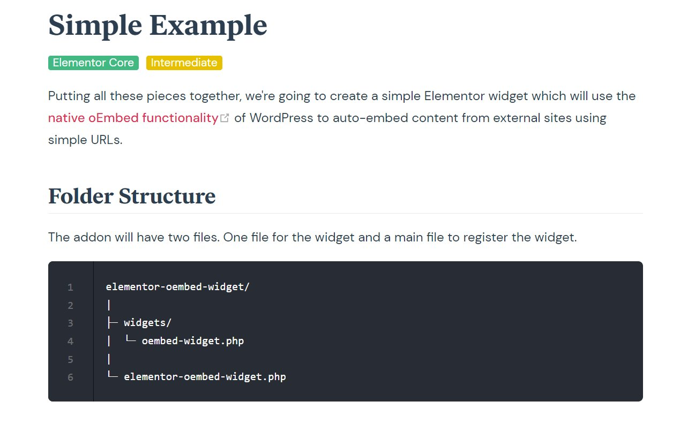

<link rel="stylesheet" href="./css/style.css">

| **Tutorial Name**    | **Build Custom Elementor Widgets from scratch [Playlist]** |
| -------------------- | ---------------------------------------------------------- |
| File Name            | README.md                                                  |
| Date Created         | 12/21/23                                                   |
| Date Modified        | --                                                         |
| Platform             | Website                                                    |
| Channel              | Elementor Developers                                      |
| Version              | 0.0.1                                                      |
| Programmer / Student | **Eric Hepperle**                                          |

* **Tutorial URL:** https://developers.elementor.com/docs/widgets/advanced-example/

### TECHNOLOGIES


<br><br>



<br>

## Instructor Info

<section class="author-profile">
  <div class="author-img">
    
  </div>
  <div class="author-info">
    <h3><a href="https://www.youtube.com/@TechiePress" target="_blank">Elementor Developers</a></h3>
    <p>Elementor is packed with dozens of useful widgets in the widgets panel. These widgets are divided into categories. Each widget has a set of custom controls (input fields) allowing end-users to enter data.</p>
  </div>
</section>

## TAGS

`WordPress` `Elementor` `Widgets` `Custom Widgets` `Code From Scratch` `WP` `Plugins` `Elementor Developers` `Custom Plugins`

## Purpose

**<u>Tutorial Work:</u>** Learn how to build a custom Elementor widget plugins for WordPress.
    
## Requires

* WordPress installed
* Login to WordPress dashboard
* IDE like VSCode

### Description:

Complete working example custom Elementor widget plugin identified as "Simple Example":

>Putting all these pieces together, we're going to create a simple Elementor widget which will use the native oEmbed functionality (opens new window)of WordPress to auto-embed content from external sites using simple URLs.

#### TIP: the settings.json in .vscode/ folder is key to getting the compile to work.

### Folder Structure

```bash
elementor-oembed-widget/
|
├─ widgets/
|  └─ oembed-widget.php
|
└─ elementor-oembed-widget.php
```

